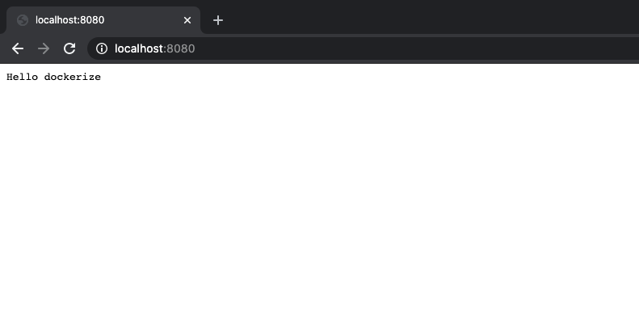

## Libraries in the Project
nodemon https://github.com/remy/nodemon

## Usage

```
$ docker build -t melih/node:hello-docker .
 
$ docker run -d -p 8080:3000 --name hello-docker-app melih/node:hello-docker

```
## Open browser 
 http://localhost:8080/
 
 


